## 👋 소개

안녕하세요, 명혜성입니다.
Java/Spring Boot 기반 백엔드 개발자로 시작해, AWS 기반 클라우드 인프라까지 함께 다루는 백엔드 엔지니어입니다. 
서비스를 만드는 데서 끝나지 않고, 서비스의 성장에 따라, 코드와 인프라도 함께 성장시키는 개발자를 지향합니다.

 

## 🌱 현재 관심 분야 / 학습 중

- 클라우드 네이티브 아키텍처와 Terraform 기반 인프라 자동화(IaC)에 대한 학습을 이어가고 있습니다.
- 개인 프로젝트 hyeseongkit(CLI `hk`)으로 여러 AI 서비스를 오가며 세션을 이어가는 개인용 허브를 만들고 있습니다
- 로컬(Ollama)·클라우드(Gemini 등) LLM을 Bifrost로 통합해 하나의 OpenAI 호환 엔드포인트로 운영하고, 코딩 에이전트와 연동하는 작업을 진행 중입니다.

 

## 🎓 Education & Activities

- **카카오 테크 부트캠프 3기**
> Cloud Native *(2025.09 ~ 2026.03)*

- **순천향대학교**
> 사물인터넷학과 *(2018.03 ~ 2024.02)*

 

## 📊 GitHub 통계

 

## 🛠️ Tech Stack

**Language**

  

**Backend**

     

**Database**

   

**Messaging**

 

**Infra & Cloud**

        

**Monitoring (PLG)**

  

**AI**

   

 

## 📫 Contact

 
